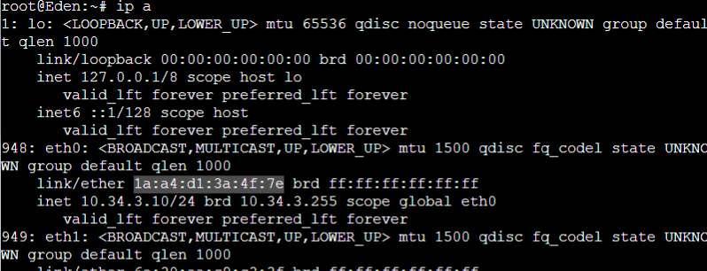
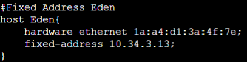
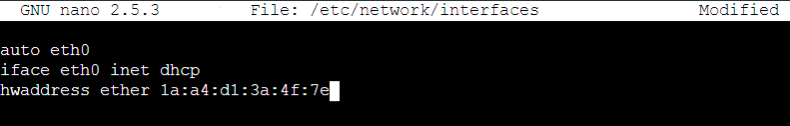
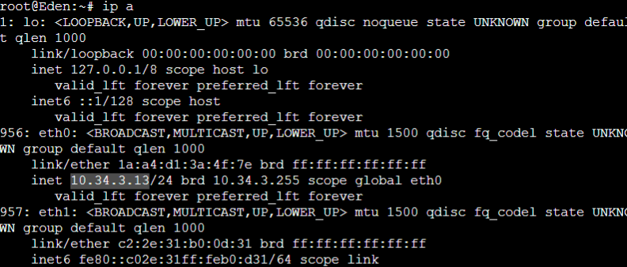
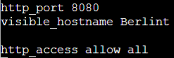
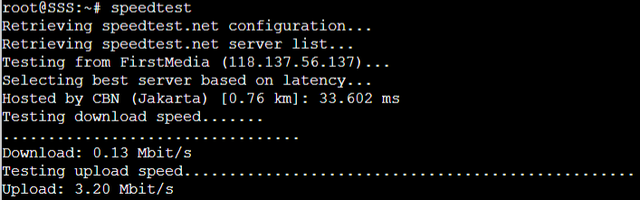

# Jarkom-Modul-3-F11-2022

### Kelompok F11

| **No** | **Nama** | **NRP** | 
| ------------- | ------------- | --------- |
| 1 | Ryo Hilmi Ridho  | 5025201192 | 
| 2 | Moh. Ilham Fakhri Zamzami | 5025201275 |
| 3 | Putu Andhika Pratama | 5025201132 |

## Soal 1

### Soal
Loid bersama Franky berencana membuat peta tersebut dengan kriteria WISE sebagai DNS Server, Westalis sebagai DHCP Server, Berlint sebagai Proxy Server

### Jawaban
Install package pada masing masing node
- Westalis
```
apt-get update
apt-get install isc-dhcp-server -y

service isc-dhcp-server start
```
- Berlint
```
apt-get update
apt-get install squid -y
```
- WISE
```
apt-get update
apt-get install bind9 -y
```

Pada node Westalis, tambahkan config pada `/etc/default/isc-dhcp-server`
```
INTERFACES="eth0"
```

Untuk soal no 3, 4, dan 6 gunakan config `/etc/dhcp/dhcpd.conf` pada node Westalis
```
subnet 10.34.2.0 netmask 255.255.255.0{
    option routers 10.34.2.1;
}

# Switch 1
subnet 10.34.1.0 netmask 255.255.255.0 {
    range 10.34.1.50 10.34.1.88;
    range 10.34.1.120 10.34.1.155;
    option routers 10.34.1.1;
    option broadcast-address 10.34.1.255;
    option domain-name-servers 10.34.2.2;
    default-lease-time 350;
    max-lease-time 6900;
}

# Switch 3
subnet 10.34.3.0 netmask 255.255.255.0 {
    range 10.34.3.10 10.34.3.30;
    range 10.34.3.60 10.34.3.85;
    option routers 10.34.3.1;
    option broadcast-address 10.34.3.255;
    option domain-name-servers 10.34.2.2;
    default-lease-time 700;
    max-lease-time 6900;
}
```

## Soal 2

### Soal
Jadikan Ostania sebagai DHCP Relay

### Jawaban
Install package relay
```
apt-get update
apt-get instal isc-dhcp-relay -y
```
Lalu tambahkan config pada `/etc/default/isc-dhcp-relay`
```
SERVERS="10.34.2.4"
INTERFACES="eth1 eth2 eth3"
```

## Soal 3

### Soal
Client yang melalui Switch1 mendapatkan range IP dari [prefix IP].1.50 - [prefix IP].1.88 dan [prefix IP].1.120 - [prefix IP].1.155

### Jawaban
Gunakan option berikut pada `dhcpd.conf`
```
range 10.34.1.50 10.34.1.88;
range 10.34.1.120 10.34.1.155;
```    

## Soal 4

### Soal
Client yang melalui Switch3 mendapatkan range IP dari [prefix IP].3.10 - [prefix IP].3.30 dan [prefix IP].3.60 - [prefix IP].3.85

### Jawaban
Gunakan option berikut pada `dhcpd.conf`
```
range 10.34.3.10 10.34.3.30;
range 10.34.3.60 10.34.3.85;
```    

## Soal 5

### Soal
Client mendapatkan DNS dari WISE dan client dapat terhubung dengan internet melalui DNS tersebut.

### Jawaban
Pada node WISE, tambahkan config untuk `/etc/bind/named.conf.options`
```
forwarders {
      192.168.122.1;
};

allow-query{any;};
```

## Soal 6

### Soal
Lama waktu DHCP server meminjamkan alamat IP kepada Client yang melalui Switch1 selama 5 menit sedangkan pada client yang melalui Switch3 selama 10 menit. Dengan waktu maksimal yang dialokasikan untuk peminjaman alamat IP selama 115 menit.

### Jawaban
Ubah default-lease-time dan max-lease-time di dalam `dhcpd.conf` menjadi
```
default-lease-time 350; # Switch 1
default-lease-time 700; # Switch 3
max-lease-time 6900;
```


## Soal 7

### Soal
Loid dan Franky berencana menjadikan Eden sebagai server untuk pertukaran informasi dengan alamat IP yang tetap dengan IP [prefix IP].3.13

### Jawaban
Jalankan `ip a` untuk mendapatkan hwaddress Eden



Lalu edit file `dhcpd.conf` pada Westalis tambahkan



Kemudia restart `service isc-dhcp-server restart`

Edit konfigurasi pada node Eden, Hardware addresss perlu di-setting juga di /etc/network/interfaces untuk mencegah bergantinya hwaddress saat project GNS3 dimatikan atau diexport.



Periksa IP Eden dengan melakukan `ip a`




## Proxy Server

### Soal 
SSS, Garden dan Eden digunakan sebagai client Proxy agar pertukaran informasi dapat terjamin keamanannya, juga untuk mencegah kebocoran data. Pada Proxy Server di Berlint, Loid berencana untuk mengatur bagaimana Client dapat mengakses internet. Artinya setiap client harus menggunakan Berlint sebagai HTTP & HTTPS proxy.

### Jawaban
Pada node Berlint edit file konfigurasi squid pada `/etc/squid/squid.conf`



Kemudian restart squid `service squid restart`

Pada node SSS, Garden dan Eden aktifkan proxy menggunakan IP Berlint

`export http_proxy=http://10.34.2.3:8080`

Coba akses halaman web http://its.ac.id

`lynx http://its.ac.id`

### Soal 1
Client hanya dapat mengakses internet diluar (selain) hari & jam kerja (senin-jumat 08.00 - 17.00) dan hari libur (dapat mengakses 24 jam penuh)

### Jawaban

buat file baru `nano /etc/squid/acl.conf` lalu masukkan

```
acl AVAILABLE_WORKING_1 time MTWHF 00:00-08:00
acl AVAILABLE_WORKING_2 time MTWHF 17:00-24:00
acl AVAILABLE_WORKING_3 time SA 00:00-24:00
```

Kemudian edit file `/etc/squid/squid.conf`

```
include /etc/squid/acl.conf

http_port 8080
visible_hostname Berlint

http_access allow AVAILABLE_WORKING_1
http_access allow AVAILABLE_WORKING_2
http_access allow AVAILABLE_WORKING_3
http_access deny all
```

### Soal 4
Agar menghemat penggunaan, akses internet dibatasi dengan kecepatan maksimum 128 Kbps pada setiap host (Kbps = kilobit per second; lakukan pengecekan pada tiap host, ketika 2 host akses internet pada saat bersamaan, keduanya mendapatkan speed maksimal yaitu 128 Kbps)

### Jawaban
Buat file bernama acl-bandwidth.conf di folder squid `nano /etc/squid/acl-bandwidth.conf` lalu masukkan

```
delay_pools 1
delay_class 1 1
delay_access 1 allow all
delay_parameters 1 16000/16000
```

Kemudian edit file `/etc/squid/squid.conf`

```
include /etc/squid/acl.conf
include /etc/squid/acl-bandwidth.conf

http_port 8080
visible_hostname Berlint

http_access allow AVAILABLE_WORKING_1
http_access allow AVAILABLE_WORKING_2
http_access allow AVAILABLE_WORKING_3
http_access deny all
```

Coba kecepatan internet dengan speedtest


